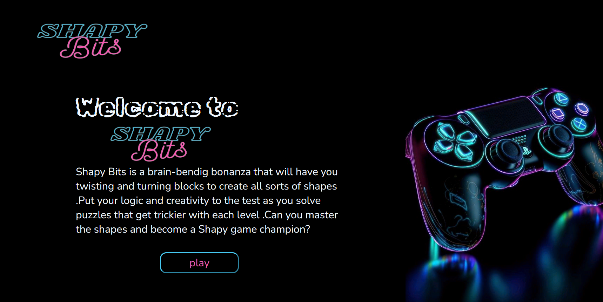

# Shapy Bits : the Geometric Shapes Learning Game

This Python project, developed as part of our third year at ESTIN (1CS), focuses on implementing an interactive game designed to aid users in learning about geometric shapes. The project utilizes an expert system based on the AIMA (Artificial Intelligence: A Modern Approach) library to provide guidance and quizzes to users, enhancing their understanding of geometric concepts through interactive gameplay.

## the interface


## the demo
check it here :<a href="#">comming soon</a>

## Clone the repo

```bash
git clone https://github.com/your_username/geometric-shapes-game.git
